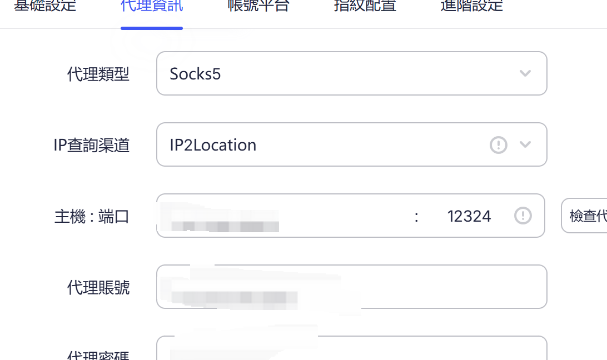
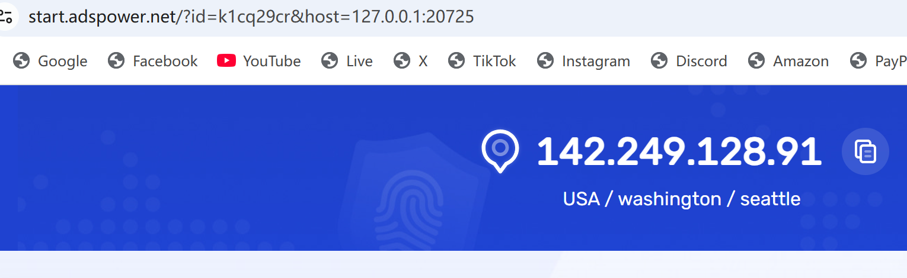
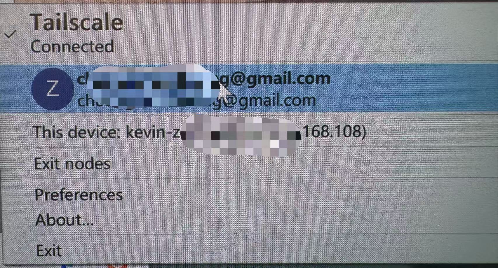

如何使用 Anthropic Claude Code in HongKong (CC is unavailable in HK)

1 -注册账号

1.1 CC账户：建议用个人的gmail等账户注册CC 账户

1.2 Apple ID：创建一个美区Apple ID--可以先创建一个中国/香港的appleid,然后记得填写自己常用的手机号码（测试过香港及内地的号码完全没问题）然后切换到美国去，使用【地址生成器】填写美国地址等信息即可成功创建。

1.3 魔法：注册魔法账号并且购买相应服务套餐

2 -安全使用（*重点*）

2.1 节点纯净度控制 = 访问AI工具 在身份认证时的IP稳定度和纯净度

我分两步（开车高速出去<魔法> + 获准放行到目的地检票站<访问的终端显示IP>）来说明这个链路，同SSH + 私钥的道理一样。

以下是 3个方法 和上述提到的两步的具象做 mapping：

- 2.1  Method 1:(premium)   clash Verge机场订阅 + 指纹浏览器 + 家居住宅IP

-找到靠谱的机场下载订阅导入到clash verge中 连接魔法（此时ip多为 万人骑的脏ip）

-使用指纹浏览器（和IP当地的时间、语言保持一致，指纹保持一致），推荐Adspower（免费），在首页配置如下，导入 家居住宅IP、port，遵循socks5协议，再输入购买后提供的账户和密码即可。

-家具住宅IP，需要氪金按月付费，固定的高纯度IP， 推荐 Bright Data 、IPRoyal等供应商。

-2.1  Method 2:(complex) 自制魔法-ISP +Tailscale + Exit node

这个方法 是自己搭建魔法，思考量和工作量较大。

-ISP： 推荐AWS， Tencent /Ali cloud 也可。 推荐选择Ubuntu LTS 作为VM的OS，然后流量按量收费，一般不超过10刀/月。地区选择Japan/Singapore 到HK的延迟小，访问体验好。安装好后记得保存后访问这台ISP的私钥（private pem），勾选静态ip。

-Tailscale : 在AWS的服务器里面 安装启用 Tailscale服务。（Tailscale底层用的是WireGuard加密协议，所有流量都走端到端加密隧道，不经过其他第三方。）

-安装口令(linux) :curl-fsSL https://tailscale.com/install.sh | sh
 
 访问 需要用到上述的私钥

-Exit node（所有流量代理出口都从这里走）

-启用口令(linux): tailscale up--advertise-exit-node

-然后去 Tailscale 的管理后台（ login.tailscale.com），在 Machines 列表里找到这台服务器，点击 Edit route settings，勾选 "Use as exit node"。

-打开后，所有流量都从你选择的ISP出去，然后就可以直接访问cc了。

-2.1  Method 3 (easy 但不太推荐) 成熟魔法 固定节点访问

成熟魔法产品 IP纯净度一半，容易触发封控，机场IP比成熟魔法更差但是机场便宜很多。

-2.2 登录Web端 claude code：使用注册好的CC账户登录网页版然后在个人设置-隐私那里关闭Location metadata 和 Help improve Claude；

-2.3  下载desktop/client:按需下载desktop客户端 或cc client

** client下载后就是CMD/PS 黑框框，在认证的那一刻一定要走指纹浏览器去Auth，然后关掉，认证通过后 cli对IP的纯净度要求很低。

3 -购买与续费

-3.1 如有外国信用卡，可直接Web 通过PayPal、信用卡/App store 进行订阅付费；

-3.2 如无外国信用卡，建议最稳妥的登录apple.com(美区)购买gift card，然后按月按月充值！不要按年购买，然后5x和20x都需要交税，所以建议买gift card需要预留多10%的金额充值到Apple id中，然后通过Apple Store来给账户按月充值。

以上，我会持续更新一些新的技术方案， 下次也会写一篇 CODEX的 访问方式的分享

未来，我不确定我会主力用哪一家， 毕竟Opus 4.7/4.8 表现麻麻地。
